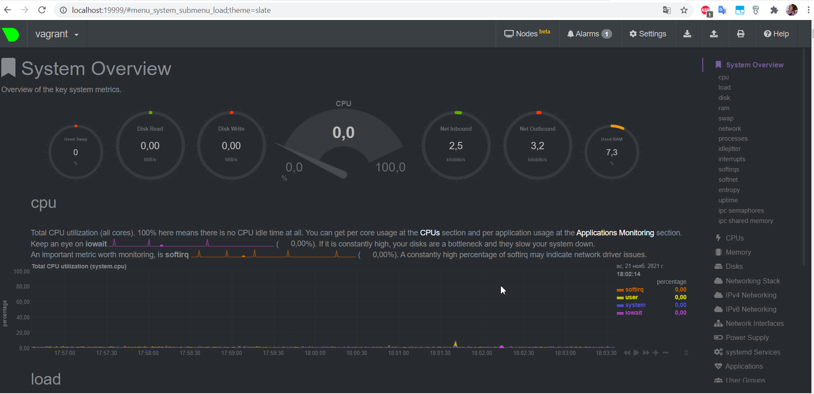

1.  
```bash
vagrant@vagrant:~$ cat /etc/systemd/system/node_exporter.service
[Unit]
Description=node_exporter
After=network.target

[Service]
Type=simple
ExecStart=/etc/node_exporter-1.3.0.linux-amd64/node_exporter $EXTRA_OPTS
ExecReload=/bin/kill -HUP $MAINPID
KillMode=process
Restart=on-failure


[Install]
WantedBy=multi-user.target 
```
2. Например:  
```
# HELP node_cpu_seconds_total Seconds the CPUs spent in each mode.
# HELP node_disk_io_now
# HELP node_load1 1m load average.
# HELP node_load15 15m load average.
# HELP node_load5 5m load average.
# HELP node_memory_MemAvailable_bytes Memory information field MemAvailable_bytes.
# HELP node_memory_MemFree_bytes Memory information field MemFree_bytes.
# HELP node_memory_MemTotal_bytes Memory information field MemTotal_bytes.
# HELP node_memory_SwapFree_bytes Поле информации о памяти SwapFree_bytes.
# HELP node_memory_SwapTotal_bytes Поле информации о памяти SwapTotal_bytes.
# HELP node_network_receive_bytes_total Network device statistic receive_bytes.
# HELP node_network_speed_bytes speed_bytes value of /sys/class/net/<iface>.
# HELP node_network_transmit_bytes_total Network device statistic transmit_bytes.
# HELP node_pressure_cpu_waiting_seconds_total Total time in seconds that processes have waited for CPU time

```
3.   

4. 
```bash
vagrant@vagrant:~$ sudo dmesg | grep -i virtual
[    0.000000] DMI: innotek GmbH VirtualBox/VirtualBox, BIOS VirtualBox 12/01/2006
[    0.001938] CPU MTRRs all blank - virtualized system.
[    0.090244] Booting paravirtualized kernel on KVM
[    0.243165] Performance Events: PMU not available due to virtualization, using software events only.
[    2.967881] systemd[1]: Detected virtualization oracle.
```
5. `https://www.kernel.org/doc/Documentation/sysctl/fs.txt` `nr_open` максимальное количество дескрипторов файлов, которое может выделить процесс.
```
...
nr_open:

This denotes the maximum number of file-handles a process can
allocate. Default value is 1024*1024 (1048576) which should be
enough for most machines. Actual limit depends on RLIMIT_NOFILE
resource limit. 
...
```
```bash
vagrant@vagrant:~$ sysctl -n fs.nr_open
1048576 
```
В `ulimit` прописано ограничение на максимальное количество открытых файловых дескрипторов.  
Ulimit – это встроенная команда оболочки, предназначенная для отображения, распределения и ограничения ресурсов.
```bash
vagrant@vagrant:~$ ulimit -n
1024
```
6.  
```bash
root@vagrant:~# ps aux |grep sleep
root       37035  0.0  0.0   8080   532 pts/1    S+   15:38   0:00 unshare -f --pid --mount-proc sleep 1h
root       37036  0.0  0.0   8076   596 pts/1    S+   15:38   0:00 sleep 1h
root       37058  0.0  0.0   8900   672 pts/0    S+   15:40   0:00 grep --color=auto sleep
root@vagrant:~# nsenter --target 37036 --pid --mount
root@vagrant:/# ps aux
USER         PID %CPU %MEM    VSZ   RSS TTY      STAT START   TIME COMMAND
root           1  0.0  0.0   8076   596 pts/1    S+   15:38   0:00 sleep 1h
root           2  0.0  0.2   9836  4112 pts/0    S    15:40   0:00 -bash
root          11  0.0  0.1  11492  3300 pts/0    R+   15:41   0:00 ps aux 
```
7. Конструкция `:(){ :|:& };:` называется `fork-бомба`  
[https://ru.wikipedia.org/wiki/Fork-%D0%B1%D0%BE%D0%BC%D0%B1%D0%B0]()  
```bash
vagrant@vagrant:~$ dmesg
[  123.216756] cgroup: fork rejected by pids controller in /user.slice/user-1000.slice/session-1.scope 
```
Автоматической стабилизации помог `cgroup`  
[https://www.kernel.org/doc/Documentation/cgroup-v1/pids.txt]()
```
...
Usage
-----

In order to use the `pids` controller, set the maximum number of tasks in
pids.max (this is not available in the root cgroup for obvious reasons). The
number of processes currently in the cgroup is given by pids.current.
...
```