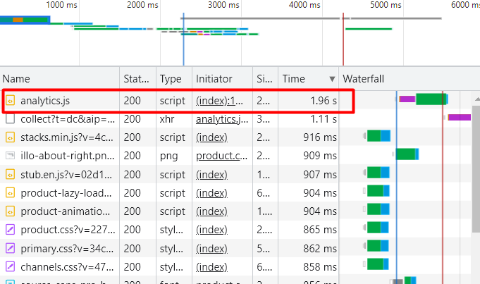
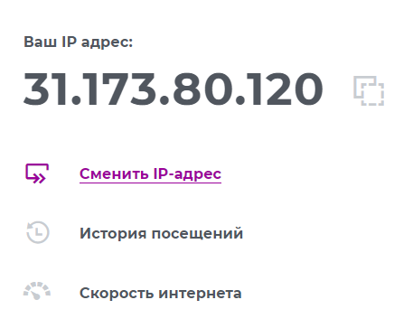

1. Мы запросили страницу `http://stackoverflow.com/questions`, на что получили ответ `301 Moved Permanently`, что означает что страница перемещена по адресу `https://stackoverflow.com/questions`
```bash
vagrant@vagrant:~$ telnet stackoverflow.com 80
Trying 151.101.65.69...
Connected to stackoverflow.com.
Escape character is '^]'.
GET /questions HTTP/1.0
HOST: stackoverflow.com

HTTP/1.1 301 Moved Permanently
cache-control: no-cache, no-store, must-revalidate
location: https://stackoverflow.com/questions
x-request-guid: 20a1e848-5f8e-4059-b2e3-733752959984
feature-policy: microphone 'none'; speaker 'none'
content-security-policy: upgrade-insecure-requests; frame-ancestors 'self' https://stackexchange.com
Accept-Ranges: bytes
Date: Fri, 26 Nov 2021 18:37:49 GMT
Via: 1.1 varnish
Connection: close
X-Served-By: cache-fra19143-FRA
X-Cache: MISS
X-Cache-Hits: 0
X-Timer: S1637951869.332532,VS0,VE92
Vary: Fastly-SSL
X-DNS-Prefetch-Control: off
Set-Cookie: prov=df18353b-2181-b447-b809-aca7149aea5a; domain=.stackoverflow.com; expires=Fri, 01-Jan-2055 00:00:00 GMT; path=/; HttpOnly

Connection closed by foreign host.
```
2.  Долше всего обрабатывался скрипт `analitics.js`


```html
HTTP/1.1 301 Moved Permanently
cache-control: no-cache, no-store, must-revalidate
location: https://stackoverflow.com/
x-request-guid: a346ba4a-396d-41c4-b044-497b4552457f
feature-policy: microphone 'none'; speaker 'none'
content-security-policy: upgrade-insecure-requests; frame-ancestors 'self' https://stackexchange.com
Transfer-Encoding: chunked
Accept-Ranges: bytes
Date: Sat, 27 Nov 2021 09:45:07 GMT
Via: 1.1 varnish
Connection: keep-alive
X-Served-By: cache-hhn4075-HHN
X-Cache: MISS
X-Cache-Hits: 0
X-Timer: S1638006308.855850,VS0,VE92
Vary: Fastly-SSL
X-DNS-Prefetch-Control: off
```
3. `31.173.80.120`  
`https://2ip.ru/`:

4. Провайдер `MegaFon`, автономная система`AS25159`
```bash
~$ whois 31.173.80.120 
...
% Information related to '31.173.80.0/21AS25159'

route:          31.173.80.0/21
descr:          MegaFon-Moscow
origin:         AS25159
mnt-by:         MEGAFON-RIPE-MNT
mnt-by:         MEGAFON-AUTO-MNT
mnt-by:         GDC-TR-CoreIP
created:        2015-07-29T07:54:27Z
last-modified:  2021-08-16T12:28:40Z
source:         RIPE
...
```
5.  
```bash
~$ traceroute -An 8.8.8.8
traceroute to 8.8.8.8 (8.8.8.8), 30 hops max, 60 byte packets
 1  140.91.222.93 [AS31898]  0.191 ms 140.91.222.37 [AS31898]  0.260 ms 140.91.222.74 [AS31898]  0.233 ms
 2  213.248.98.185 [AS1299]  0.640 ms  0.668 ms  0.647 ms
 3  213.248.98.184 [AS1299]  0.462 ms  0.442 ms  0.399 ms
 4  62.115.124.78 [AS1299]  1.941 ms  1.751 ms  1.827 ms
 5  62.115.137.65 [AS1299]  1.942 ms 62.115.136.195 [AS1299]  2.154 ms 62.115.137.65 [AS1299]  2.163 ms
 6  72.14.213.8 [AS15169]  2.896 ms  2.165 ms  2.141 ms
 7  * * *
 8  8.8.8.8 [AS15169]  1.231 ms  1.148 ms  1.251 ms

```
6. Наибольшая задержка на участке `6. AS15169  72.14.213.8 `
```bash
~$ mtr -zn 8.8.8.8
                             My traceroute  [v0.93]
gorkov-me (172.17.0.14)                                2021-11-27T10:26:12+0000
Keys:  Help   Display mode   Restart statistics   Order of fields   quit
                                       Packets               Pings
 Host                                Loss%   Snt   Last   Avg  Best  Wrst StDev
 1. AS31898  140.91.222.66            0.0%    11    0.2   0.2   0.2   0.3   0.0
 2. AS1299   213.248.98.185           0.0%    11    0.7   2.1   0.6  14.7   4.2
 3. AS1299   213.248.98.184           0.0%    11    0.6   0.7   0.6   1.1   0.1
 4. AS1299   62.115.124.80            0.0%    11    1.8   1.9   1.8   2.1   0.1
 5. AS1299   62.115.137.65            0.0%    11    2.2   2.2   2.0   3.1   0.3
 6. AS15169  72.14.213.8              0.0%    11    2.3   2.5   2.1   3.2   0.4
 7. AS15169  72.14.239.107            0.0%    11    1.1   1.3   1.1   1.4   0.1
 8. AS15169  142.251.48.179           0.0%    11    1.1   1.2   1.1   1.5   0.1
 9. AS15169  8.8.8.8                  0.0%    10    1.3   1.3   1.3   1.3   0.0
```

7. DNS сервера `dns.google.` c `A` записями: `8.8.4.4` и `8.8.8.8` 
```bash
~$ dig dns.google

; <<>> DiG 9.16.1-Ubuntu <<>> dns.google
;; global options: +cmd
;; Got answer:
;; ->>HEADER<<- opcode: QUERY, status: NOERROR, id: 51977
;; flags: qr rd ra; QUERY: 1, ANSWER: 2, AUTHORITY: 0, ADDITIONAL: 1

;; OPT PSEUDOSECTION:
; EDNS: version: 0, flags:; udp: 65494
;; QUESTION SECTION:
;dns.google.                    IN      A

;; ANSWER SECTION:
dns.google.             625     IN      A       8.8.4.4
dns.google.             625     IN      A       8.8.8.8

;; Query time: 399 msec
;; SERVER: 127.0.0.53#53(127.0.0.53)
;; WHEN: Sat Nov 27 10:29:43 UTC 2021
;; MSG SIZE  rcvd: 71
```
8. `PTR` `dns.google.`
```bash
~$ dig -x 8.8.4.4

...

;; QUESTION SECTION:
;4.4.8.8.in-addr.arpa.          IN      PTR

;; ANSWER SECTION:
4.4.8.8.in-addr.arpa.   10411   IN      PTR     dns.google.

...
```
```bash
~$ dig -x 8.8.8.8

...

;; QUESTION SECTION:
;8.8.8.8.in-addr.arpa.          IN      PTR

;; ANSWER SECTION:
8.8.8.8.in-addr.arpa.   9955    IN      PTR     dns.google.

...
```