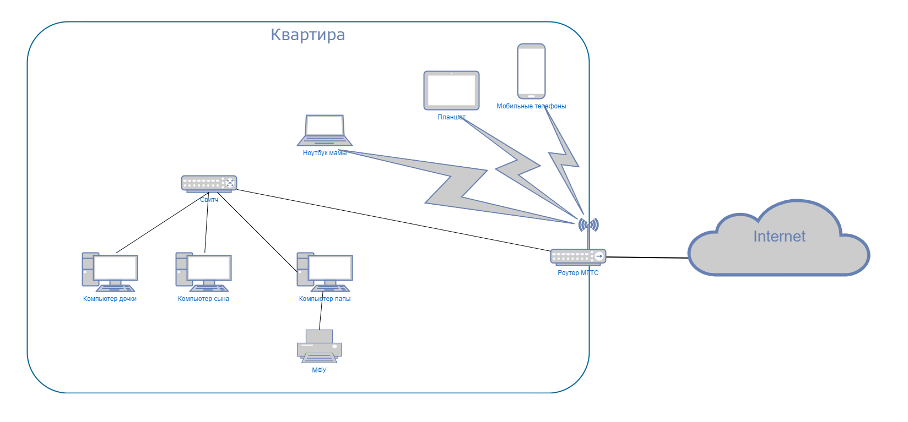

1. 

```
route-views>show ip route 152.70.50.114
Routing entry for 152.70.48.0/20
  Known via "bgp 6447", distance 20, metric 10
  Tag 3257, type external
  Last update from 89.149.178.10 4w5d ago
  Routing Descriptor Blocks:
  * 89.149.178.10, from 89.149.178.10, 4w5d ago
      Route metric is 10, traffic share count is 1
      AS Hops 2
      Route tag 3257
      MPLS label: none
route-views>show bgp 152.70.50.114
BGP routing table entry for 152.70.48.0/20, version 1223355600
Paths: (24 available, best #17, table default)
  Not advertised to any peer
  Refresh Epoch 1
  4901 6079 3257 31898
    162.250.137.254 from 162.250.137.254 (162.250.137.254)
      Origin IGP, localpref 100, valid, external
      Community: 65000:10100 65000:10300 65000:10400
      path 7FE03E1E56F0 RPKI State not found
      rx pathid: 0, tx pathid: 0
  Refresh Epoch 3
  3303 3356 31898
    217.192.89.50 from 217.192.89.50 (138.187.128.158)
      Origin IGP, localpref 100, valid, external
      Community: 3303:1004 3303:1007 3303:3067 3356:2 3356:22 3356:100 3356:123                                                                                                              3356:503 3356:903 3356:2067 3356:10037 31898:12012 31898:13016
      path 7FE0DE4AA6C8 RPKI State not found
      rx pathid: 0, tx pathid: 0
  Refresh Epoch 1
  7660 2516 3257 31898
    203.181.248.168 from 203.181.248.168 (203.181.248.168)
      Origin IGP, localpref 100, valid, external
      Community: 2516:1030 7660:9003

```
2.   
```
root@vagrant:~# ip a
1: lo: <LOOPBACK,UP,LOWER_UP> mtu 65536 qdisc noqueue state UNKNOWN group default qlen 1000
    link/loopback 00:00:00:00:00:00 brd 00:00:00:00:00:00
    inet 127.0.0.1/8 scope host lo
       valid_lft forever preferred_lft forever
    inet6 ::1/128 scope host
       valid_lft forever preferred_lft forever
2: eth0: <BROADCAST,MULTICAST,UP,LOWER_UP> mtu 1500 qdisc fq_codel state UP group default qlen 1000
    link/ether 08:00:27:73:60:cf brd ff:ff:ff:ff:ff:ff
    inet 10.0.2.15/24 brd 10.0.2.255 scope global dynamic eth0
       valid_lft 86015sec preferred_lft 86015sec
    inet6 fe80::a00:27ff:fe73:60cf/64 scope link
       valid_lft forever preferred_lft forever
3: eth1: <BROADCAST,MULTICAST,UP,LOWER_UP> mtu 1500 qdisc fq_codel state UP group default qlen 1000
    link/ether 08:00:27:45:cd:37 brd ff:ff:ff:ff:ff:ff
    inet 192.168.94.120/24 brd 192.168.94.255 scope global dynamic eth1
       valid_lft 3214sec preferred_lft 3214sec
    inet6 fe80::a00:27ff:fe45:cd37/64 scope link
       valid_lft forever preferred_lft forever
4: dummy2: <BROADCAST,NOARP> mtu 1500 qdisc noop state DOWN group default qlen 1000
    link/ether 86:89:55:74:c0:25 brd ff:ff:ff:ff:ff:ff
    inet 192.168.1.150/24 scope global dummy2
       valid_lft forever preferred_lft forever
```
  
```
root@vagrant:~# ip route add 172.16.10.0/24 dev eth0
root@vagrant:~# ip route add 172.16.0.0/24 dev eth1
root@vagrant:~# ip route
default via 10.0.2.2 dev eth0 proto dhcp src 10.0.2.15 metric 100
default via 192.168.94.206 dev eth1 proto dhcp src 192.168.94.120 metric 100
10.0.2.0/24 dev eth0 proto kernel scope link src 10.0.2.15
10.0.2.2 dev eth0 proto dhcp scope link src 10.0.2.15 metric 100
172.16.0.0/24 dev eth1 scope link
172.16.10.0/24 dev eth0 scope link
192.168.94.0/24 dev eth1 proto kernel scope link src 192.168.94.120
192.168.94.206 dev eth1 proto dhcp scope link src 192.168.94.120 metric 100
```
3. Например порт `22` используется для подключений к  `ssh` серверу. Используется сервисом `sshd`.  
Порт `53` используется `systemd-resolve`, служба `systemd`, выполняющая разрешение сетевых имён для локальных приложений посредством D-Bus, NSS-службы resolve или локальной слушающей DNS-заглушки на адресе `127.0.0.53`

```bash
$ sudo netstat -ntlp
Active Internet connections (only servers)
Proto Recv-Q Send-Q Local Address           Foreign Address         State       PID/Program name
tcp        0      0 0.0.0.0:111             0.0.0.0:*               LISTEN      1/init
tcp        0      0 127.0.0.53:53           0.0.0.0:*               LISTEN      577/systemd-resolve
tcp        0      0 0.0.0.0:22              0.0.0.0:*               LISTEN      830/sshd: /usr/sbin
tcp6       0      0 :::111                  :::*                    LISTEN      1/init
tcp6       0      0 :::22                   :::*                    LISTEN      830/sshd: /usr/sbin
```
4. В `udp` также присутствует `53` порт для разрешения имен.  
Еще добавился порт `68`, его использует служба `systemd-network` для работы протокола `DHCP`.

```
root@vagrant:~# netstat -nlpu
Active Internet connections (only servers)
Proto Recv-Q Send-Q Local Address           Foreign Address         State       PID/Program name
udp        0      0 0.0.0.0:111             0.0.0.0:*                           1/init
udp        0      0 127.0.0.53:53           0.0.0.0:*                           572/systemd-resolve
udp        0      0 192.168.94.120:68       0.0.0.0:*                           415/systemd-network
udp        0      0 10.0.2.15:68            0.0.0.0:*                           415/systemd-network
udp6       0      0 :::111                  :::*                                1/init
```

5. 

