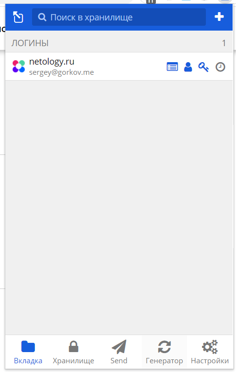
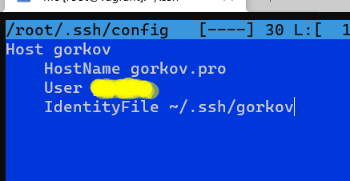
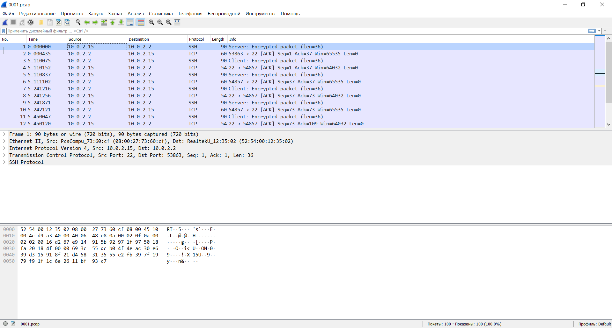

1.   

2.   

3. У меня есть свой домен для почты [gorkov.pro](https://gorkov.pro/), который хостится на бесплатной виртуалке от оракла, там поднят апач и получен сертификат от `let's encrypt`.  
4.   
```
root@vagrant:~/testssl.sh# ./testssl.sh -U --sneaky https://gorkov.pro/

###########################################################
    testssl.sh       3.1dev from https://testssl.sh/dev/
    (dc782a8 2021-12-08 11:50:55 -- )

      This program is free software. Distribution and
             modification under GPLv2 permitted.
      USAGE w/o ANY WARRANTY. USE IT AT YOUR OWN RISK!

       Please file bugs @ https://testssl.sh/bugs/

###########################################################

 Using "OpenSSL 1.0.2-chacha (1.0.2k-dev)" [~183 ciphers]
 on vagrant:./bin/openssl.Linux.x86_64
 (built: "Jan 18 17:12:17 2019", platform: "linux-x86_64")


 Start 2021-12-08 18:16:13        -->> 152.70.50.114:443 (gorkov.pro) <<--

 rDNS (152.70.50.114):   --
 Service detected:       HTTP


 Testing vulnerabilities

 Heartbleed (CVE-2014-0160)                not vulnerable (OK), no heartbeat extension
 CCS (CVE-2014-0224)                       not vulnerable (OK)
 Ticketbleed (CVE-2016-9244), experiment.  not vulnerable (OK), no session ticket extension
 ROBOT                                     Server does not support any cipher suites that use RSA key transport
 Secure Renegotiation (RFC 5746)           supported (OK)
 Secure Client-Initiated Renegotiation     not vulnerable (OK)
 CRIME, TLS (CVE-2012-4929)                not vulnerable (OK)
 BREACH (CVE-2013-3587)                    no gzip/deflate/compress/br HTTP compression (OK)  - only supplied "/" tested
 POODLE, SSL (CVE-2014-3566)               not vulnerable (OK)
 TLS_FALLBACK_SCSV (RFC 7507)              No fallback possible (OK), no protocol below TLS 1.2 offered
 SWEET32 (CVE-2016-2183, CVE-2016-6329)    not vulnerable (OK)
 FREAK (CVE-2015-0204)                     not vulnerable (OK)
 DROWN (CVE-2016-0800, CVE-2016-0703)      not vulnerable on this host and port (OK)
                                           make sure you don't use this certificate elsewhere with SSLv2 enabled services
                                           https://censys.io/ipv4?q=005ACD84F7F6BC929A9B671A07A40E4DD7CE51102F0E56801BF9EA42D456B767 could help you to find out
 LOGJAM (CVE-2015-4000), experimental      common prime with 2048 bits detected: RFC3526/Oakley Group 14 (2048 bits),
                                           but no DH EXPORT ciphers
 BEAST (CVE-2011-3389)                     not vulnerable (OK), no SSL3 or TLS1
 LUCKY13 (CVE-2013-0169), experimental     not vulnerable (OK)
 Winshock (CVE-2014-6321), experimental    not vulnerable (OK)
 RC4 (CVE-2013-2566, CVE-2015-2808)        no RC4 ciphers detected (OK)


 Done 2021-12-08 18:17:20 [  71s] -->> 152.70.50.114:443 (gorkov.pro) <<--
```
5.   
  
6.   
  

  
7.   
```
root@vagrant:~# tcpdump -c 100 -i eth0 -w 0001.pcap
tcpdump: listening on eth0, link-type EN10MB (Ethernet), capture size 262144 bytes
100 packets captured
101 packets received by filter
0 packets dropped by kernel
```
  
