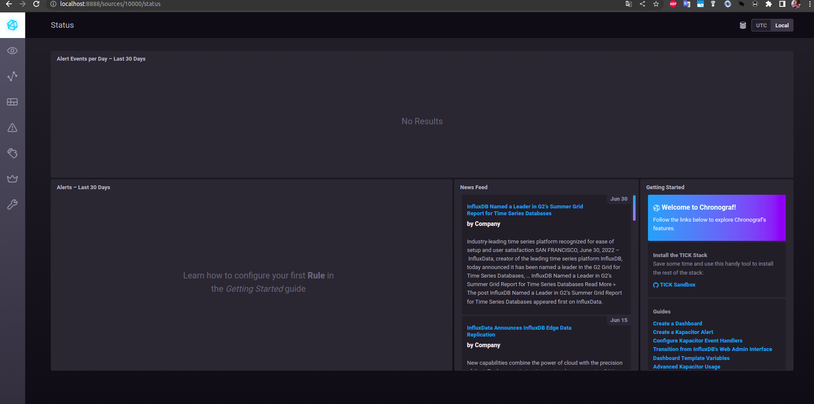
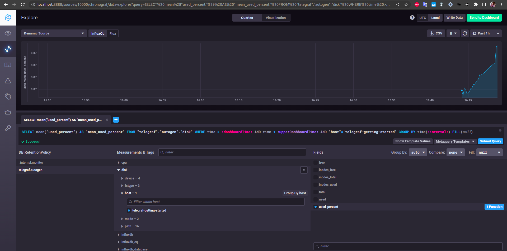
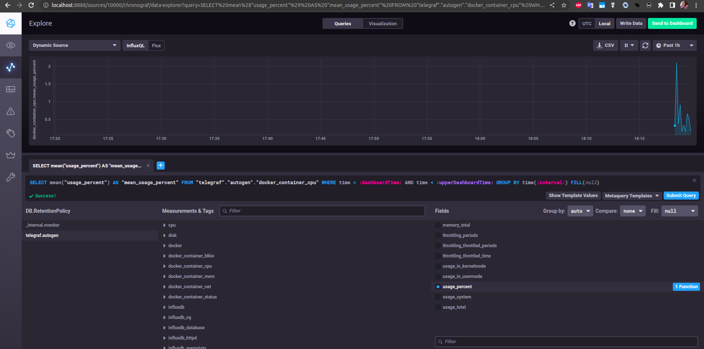

# Домашнее задание к занятию "10.02. Системы мониторинга"

## Обязательные задания

1. Опишите основные плюсы и минусы pull и push систем мониторинга.

    ### Ответ:
    Pull модель (данные собираются по запросу с сервера)  
    К плюсам можно отнести:
    - Централизованное управление, метрики можно получать в любое время, а не только как настроенно на агенте.
    - Безопасность, можно настроить TLS
    - Можно напрямую по http обратится к агенту  
  
    Из минусов можно отметить более медленный протокол по сравнению с push, где можно использовать UDP

    Push модель (данные отправляются агентами)  
    Плюсы:
    - Хорошо подходит для медленных соединений
    - Можно пушить метрики на несколько систем мониторинга

    К минусам можно отнести тот-же плюс, если использовать UDP, не гарантируется доставка пакетов.

2. Какие из ниже перечисленных систем относятся к push модели, а какие к pull? А может есть гибридные?

    - Prometheus 
    - TICK
    - Zabbix
    - VictoriaMetrics
    - Nagios

    ### Ответ:
    - Prometheus - pull модель, но можно пушить метрики в `pushgateway` с которого prometheus заберет их. ([Why do you pull rather than push?](https://prometheus.io/docs/introduction/faq/#why-do-you-pull-rather-than-push))
    - TICK - push модель
    - Zabbix - гибридная модель, активные проверки(push) отправляются постоянно с агентов, пассивные(pull) хранятся на агентах и по запросу отправляются на сервер.
    - VictoriaMetrics - гибридная ([vmagent supports both pull and push data collection](https://docs.victoriametrics.com/FAQ.html))
    - Nagios - pull модель


3. Склонируйте себе [репозиторий](https://github.com/influxdata/sandbox/tree/master) и запустите TICK-стэк, 
используя технологии docker и docker-compose.

В виде решения на это упражнение приведите выводы команд с вашего компьютера (виртуальной машины):

    - curl http://localhost:8086/ping
    - curl http://localhost:8888
    - curl http://localhost:9092/kapacitor/v1/ping


### Ответ:
```bash
gorkov@gorkov-HP-Laptop-14s:~$ curl http://localhost:8086/ping
gorkov@gorkov-HP-Laptop-14s:~$ curl http://localhost:8888
<!DOCTYPE html><html><head><meta http-equiv="Content-type" content="text/html; charset=utf-8"><title>Chronograf</title><link rel="icon shortcut" href="/favicon.fa749080.ico"><link rel="stylesheet" href="/src.9cea3e4e.css"></head><body> <div id="react-root" data-basepath=""></div> <script src="/src.a969287c.js"></script> </body></html>gorkov@gorkov-HP-Laptop-14s:~$ 
gorkov@gorkov-HP-Laptop-14s:~$ curl http://localhost:9092/kapacitor/v1/ping
gorkov@gorkov-HP-Laptop-14s:~$ 

```

А также скриншот веб-интерфейса ПО chronograf (`http://localhost:8888`). 

### Ответ:


P.S.: если при запуске некоторые контейнеры будут падать с ошибкой - проставьте им режим `Z`, например
`./data:/var/lib:Z`

1. Перейдите в веб-интерфейс Chronograf (`http://localhost:8888`) и откройте вкладку `Data explorer`.

    - Нажмите на кнопку `Add a query`
    - Изучите вывод интерфейса и выберите БД `telegraf.autogen`
    - В `measurments` выберите mem->host->telegraf_container_id , а в `fields` выберите used_percent. 
    Внизу появится график утилизации оперативной памяти в контейнере telegraf.
    - Вверху вы можете увидеть запрос, аналогичный SQL-синтаксису. 
    Поэкспериментируйте с запросом, попробуйте изменить группировку и интервал наблюдений.

Для выполнения задания приведите скриншот с отображением метрик утилизации места на диске 
(disk->host->telegraf_container_id) из веб-интерфейса.

### Ответ:
В сандбоксе в дефолтном конфиге убрали инпуты mem и disk, добавил их в `telegraf.conf`:
```
[[inputs.disk]]
[[inputs.mem]]
```


5. Изучите список [telegraf inputs](https://github.com/influxdata/telegraf/tree/master/plugins/inputs). 
Добавьте в конфигурацию telegraf следующий плагин - [docker](https://github.com/influxdata/telegraf/tree/master/plugins/inputs/docker):
```
[[inputs.docker]]
  endpoint = "unix:///var/run/docker.sock"
```

Дополнительно вам может потребоваться донастройка контейнера telegraf в `docker-compose.yml` дополнительного volume и 
режима privileged:
```
  telegraf:
    image: telegraf:1.4.0
    privileged: true
    volumes:
      - ./etc/telegraf.conf:/etc/telegraf/telegraf.conf:Z
      - /var/run/docker.sock:/var/run/docker.sock:Z
    links:
      - influxdb
    ports:
      - "8092:8092/udp"
      - "8094:8094"
      - "8125:8125/udp"
```

После настройке перезапустите telegraf, обновите веб интерфейс и приведите скриншотом список `measurments` в 
веб-интерфейсе базы telegraf.autogen . Там должны появиться метрики, связанные с docker.

### Ответ:


Факультативно можете изучить какие метрики собирает telegraf после выполнения данного задания.

## Дополнительное задание (со звездочкой*) - необязательно к выполнению

В веб-интерфейсе откройте вкладку `Dashboards`. Попробуйте создать свой dashboard с отображением:

    - утилизации ЦПУ
    - количества использованного RAM
    - утилизации пространства на дисках
    - количество поднятых контейнеров
    - аптайм
    - ...
    - фантазируйте)
    
    ---

### Как оформить ДЗ?

Выполненное домашнее задание пришлите ссылкой на .md-файл в вашем репозитории.

---
